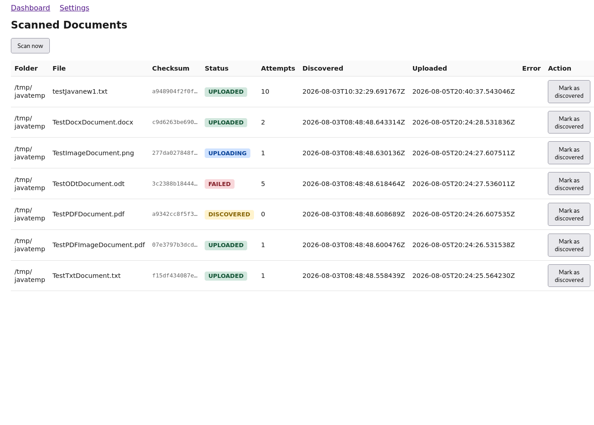
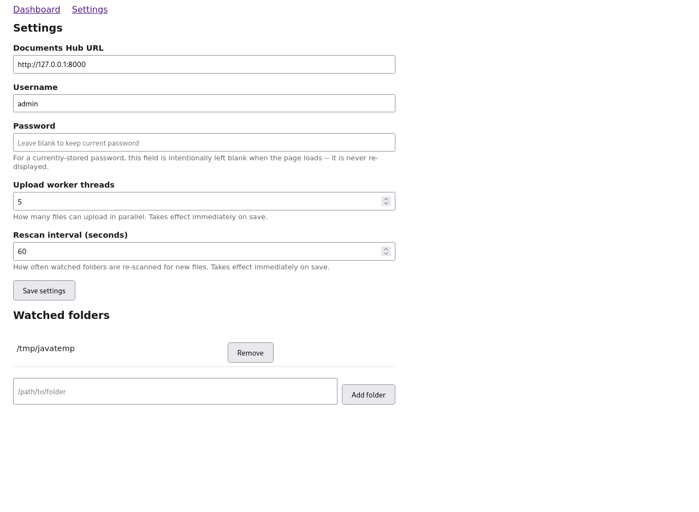

# Folder Sync Service

A lightweight configurable document ingestion agent that scans configured folders for files, and uploads newly discovered ones to [Documents Hub](../documents-hub) — the companion Django service that extracts and indexes their content for search.

Everything is configurable at runtime from a browser-based dashboard: no config file edits or restarts needed to change watched folders, credentials, worker count, or scan frequency.

## Why a separate service, and why Spring Boot

This is deliberately a distinct component from Documents Hub, communicating only over HTTP — a realistic split between "the agent that finds files" and "the service that understands them."

Spring Boot was chosen because this component is intended to run as a standalone background agent. Packaging it as an executable JAR provides a self-contained deployment unit that can run on different operating systems with a compatible JVM, without requiring a separately installed application server.

This fits the role of a document ingestion agent that may be deployed independently on different machines while maintaining a simple HTTP boundary with Documents Hub.

## How it works

```
┌──────────────────────────────────────────────────────────────┐
│                   Spring Boot app                            │
│                                                              │
│  ┌───────────────────┐      ┌─────────────────────────┐      │
│  │ RescanScheduler   │─────▶│   FolderScannerService  │      │
│  │ (reschedulable,   │      │    (walks folders,      │      │
│  │ runtime interval) │      │  computes checksums)    │      │
│  └───────────────────┘      └───────────┬─────────────┘      │
│                                         ▼                    │
│                                  ┌─────────────────┐         │
│                                  │  H2 database    │         │
│                                  │   (settings,    │         │
│                                  │    folders,     │         │
│                                  │  scanned files) │         │
│                                  └───────┬─────────┘         │
│                                          ▼                   │
│  ┌────────────────────────┐      ┌─────────────────────┐     │
│  │ UploadExecutorManager  │◀─────│   UploadService     │     │
│  │ (resizable thread pool)│      │ (retry + backoff)   │     │
│  └───────────┬────────────┘      └──────────┬──────────┘     │
│              │                              │                │
│              ▼                              ▼                │
│      upload worker threads          AuthTokenService         │
│                                      (JWT login/refresh)     │
└──────────────────────┬────────────────────────┬──────────────┘
                       │                        │
                       ▼                        ▼
               Dashboard UI               Documents Hub API
         (Thymeleaf, /  /settings)    (POST /api/documents/upload)
```

## Running it

Requires Java 21+ and Maven 3.9+.

For development:
```bash
mvn spring-boot:run
```
To create a deployable artifact:
```
mvn clean package
java -jar target/folder-sync-service-0.0.1-SNAPSHOT.jar
```

The app starts on `http://localhost:8081` (configurable via `SERVER_PORT`). On first run, an H2 database file is created at `./data/scanner` (file-based, not in-memory — settings and scan history survive a restart).

Set `SCANNER_ENCRYPTION_KEY` before storing any real credentials — this encrypts the Documents Hub password at rest. Without it, the app still runs (falls back to a hardcoded development-only key, with a warning logged), which is fine for trying the app out locally but not for anything real:
```bash
export SCANNER_ENCRYPTION_KEY=$(openssl rand -base64 32)
```

Open `http://localhost:8081/settings` first to configure:
- **Documents Hub URL** (e.g. `http://localhost:8000`)
- **Username / password** — a real Documents Hub user account, since uploads require a JWT session.
- **Worker threads** — how many uploads can run in parallel
- **Rescan interval** — how often watched folders are re-scanned
- At least one **watched folder**

Then visit `http://localhost:8081/` to monitor discovered and uploaded files, and trigger an immediate scan with "Scan now". Failed or stuck uploads can be reset back to `DISCOVERED` from the dashboard, making them eligible for processing in the next upload cycle.

## Database access (development)

The service uses a file-based H2 database (`./data/scanner`) to persist runtime configuration and scan state across restarts.

For development and troubleshooting, the H2 web console is enabled at `http://localhost:8081/h2-console` with connection details:
```
JDBC URL: jdbc:h2:file:./data/scanner
User: foldersync
Password: foldersync
```
The H2 console is enabled for development and troubleshooting. For deployments where the scanner runs on an exposed or shared host, it is recommended to disable it.

## Dashboard
The service provides a small web dashboard for monitoring discovered files, upload status, retry information, and manually triggering scan cycles.



## Settings
All operational parameters can be changed without restarting the service, including watched folders, Documents Hub credentials, worker count, and scan interval.



## Design decisions

- **Full rescan on an interval, not a persistent filesystem watch.** A `WatchService`-based live watch would notice changes instantly, but makes "configurable interval" and "resilience across restarts" much harder to reason about cleanly. A periodic full walk, checksummed against what's already known, is simpler and matches a document-ingestion use case where files arrive periodically, not in real time — the trade-off (up to one interval's delay before a new file is noticed) is acceptable here.
- **Checksum-based discovery, not filename/path-based.** The same file dropped in two different folders, or renamed, is recognized as already-known content rather than re-uploaded — dedup happens at discovery time, before an upload is even attempted, in addition to Documents Hub's own server-side checksum check.
- **A dynamically resizable worker pool**, using Spring's `ThreadPoolTaskExecutor.setCorePoolSize()` at runtime, rather than requiring a restart to change concurrency. Verified this is a genuinely supported live operation on the underlying `ThreadPoolExecutor`, not a workaround.
- **A manually-managed `ThreadPoolTaskScheduler`** for the rescan interval, instead of `@Scheduled(fixedRate=...)`. The declarative annotation is evaluated once at startup from a static property and can't be changed afterward; scheduling imperatively and keeping a handle to the current `ScheduledFuture` allows cancelling and rescheduling whenever the interval changes in settings.
- **JWTs are decoded directly to read the real `exp` claim**, rather than assuming/hardcoding a token lifetime — keeps the scanner's refresh timing accurate even if the server's token lifetime configuration changes.
- **The settings form never re-displays the stored password.** The field is always rendered blank; submitting it blank leaves the stored password untouched, submitting a value replaces it. Avoids ever putting a real credential back into rendered HTML.
- **The stored password is encrypted at rest** (AES-GCM, random IV per encryption) via a JPA `AttributeConverter`. The encryption key is sourced from the `SCANNER_ENCRYPTION_KEY` environment variable, read directly (`System.getenv()`) rather than through Spring dependency injection. If the environment variable isn't set, it falls back to a hardcoded development-only key and logs a loud warning — functional for local dev, but must be set before storing any real credentials.
- **Centralized HTTP client configuration.** All communication with Documents Hub goes through a shared RestClient builder configuration, keeping authentication and upload requests consistent and allowing HTTP behaviour to be configured in one place.

## Known limitations

- **No HTTPS enforced** for either the dashboard or the outbound calls to Documents Hub — fine for local development, not for a real deployment.
- **A failed upload attempt is treated uniformly** (retry up to a fixed max, then give up) — unlike Documents Hub's explicit permanent-vs-transient failure distinction, the scanner doesn't currently inspect *why* an upload failed before deciding to retry. Works fine in practice since Documents Hub itself already validates payloads and rejects bad ones fast, but a genuinely permanent failure (e.g. an unsupported file type) still burns through the scanner's full retry budget before giving up, rather than failing fast.
- **No pagination on the dashboard grid** — fine for a demo/portfolio scale of files, would need it for any real volume.

## What I'd change at scale

- Have the scanner inspect the upload failure response (e.g. a `422` from Documents Hub's payload validation) and skip retries for responses that are clearly permanent, rather than retrying uniformly.
- Add pagination and filtering to the dashboard.
- Package and deploy as a proper background service (systemd unit on Linux / Windows Service on Windows) rather than running it manually with `java -jar`. This would provide automatic startup, restart policies, and proper lifecycle management for production deployments.

## Running tests locally

```bash
mvn test
```
